# Lecture 13. MPP Data Processing: ClickHouse, YDB, and SingleStore

## Lecture Goal

Understand how data processing works in MPP systems, how analytical MPP, distributed SQL, and HTAP differ, and when to choose ClickHouse, YDB, or SingleStore.

### At a glance

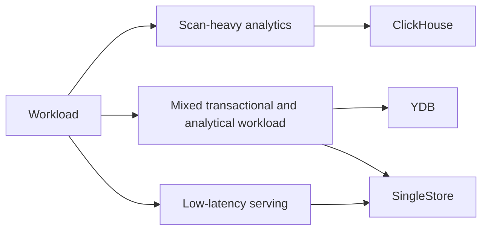

---

## 1. What is MPP Data Processing

MPP (Massively Parallel Processing) is an approach where data processing is distributed across many nodes and the query runs in parallel.

### Core idea

- data is physically distributed across a cluster;
- computation happens in parallel;
- the final result is assembled from partial results;
- scaling is achieved by adding nodes.

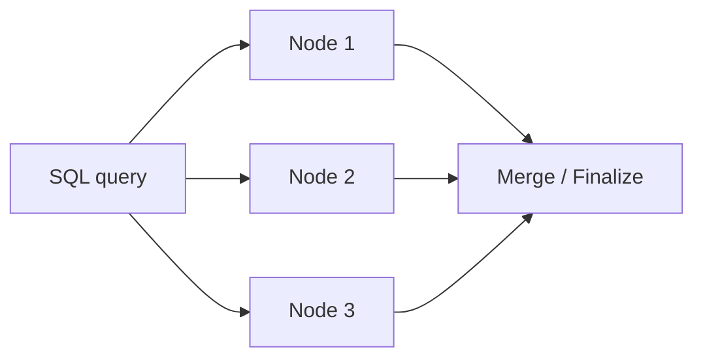

### Why MPP matters

A single server eventually hits limits in:

- CPU;
- RAM;
- disk I/O;
- network bandwidth.

MPP shifts the problem into a distributed environment, where we have to manage:

- data distribution;
- data movement;
- balancing;
- fault tolerance;
- operating cost.

### The central trade-off

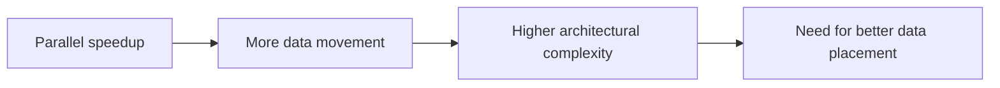

---

## 2. Three systems, three different emphases

### ClickHouse

- analytical MPP system;
- columnar storage;
- vectorized execution;
- strongest in scan-heavy analytics.

### YDB

- distributed SQL / MPP DBMS;
- strong consistency and ACID;
- columnar tables for analytics;
- suitable for both transactional and analytical workloads in one system.

### SingleStore

- distributed SQL with an HTAP approach;
- rowstore + columnstore;
- suitable for transactional and analytical workloads;
- focuses on universality and low-latency analytics.

### High-level map

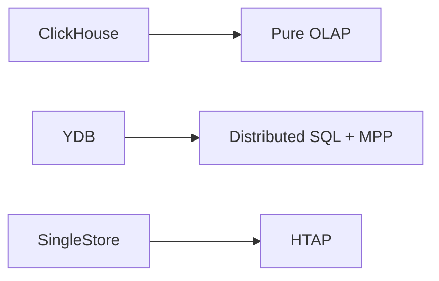

### How to read the map

- ClickHouse is the strongest choice when the workload is dominated by analytical scans.
- YDB is attractive when distributed SQL, strong consistency, and analytical capabilities must coexist.
- SingleStore is useful when one platform should cover both transactional and analytical workloads.

---

## 3. The common analytical query pipeline

MPP analytics usually follows this pipeline:

`SCAN -> FILTER -> PROJECT -> AGGREGATE -> SHUFFLE -> MERGE`

### Where the bottlenecks appear

1. **SCAN**
   - too much data on disk;
   - too many columns;
   - poor ordering or a weak storage model.

2. **FILTER**
   - if pruning is ineffective, the system reads too much.

3. **AGGREGATE**
   - the hash table may not fit in memory;
   - high-cardinality GROUP BY becomes expensive.

4. **SHUFFLE**
   - data has to move between nodes;
   - the network often becomes the main bottleneck.

5. **MERGE**
   - partial results must be combined;
   - the final phase can limit scalability.

### Main conclusion

MPP makes processing faster, but it almost always adds a cost in the form of data movement.

### Visual summary

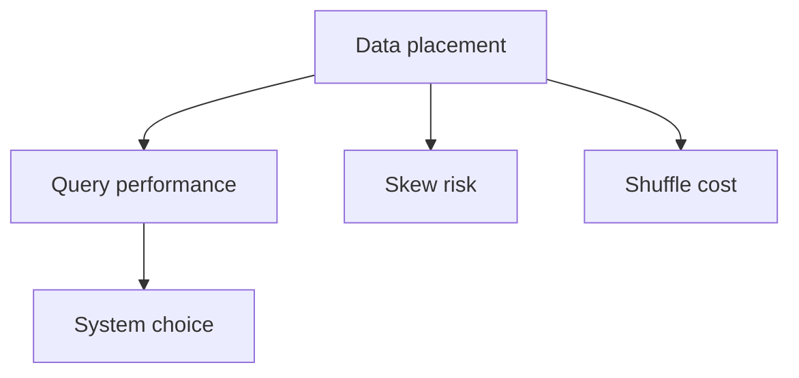

---

## 4. Three techniques that make MPP fast

## 4.1. Columnar storage

Data is stored by columns, not by rows.

### What it gives us

- only the needed columns are read;
- better compression;
- less I/O;
- convenient for filters and aggregations.

### Typical scan pattern

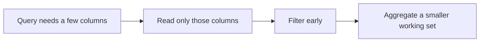

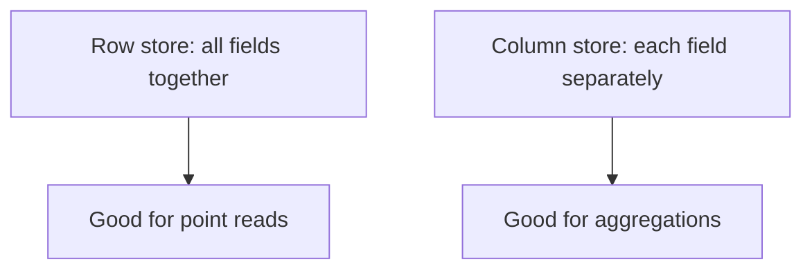

### Where it shines

- time-series;
- event analytics;
- dashboard queries;
- wide tables.

---

## 4.2. Vectorized execution

Instead of processing one row at a time, the engine works on blocks.

### Why it matters

- lower function-call overhead;
- better cache locality;
- easier SIMD usage;
- higher throughput for simple expressions and aggregates.

### Practical meaning

Vectorized engines work especially well when:

- the query shape is simple;
- the data is already filtered well;
- the workload consists of many repeated operations.

### Why this matters for the CPU

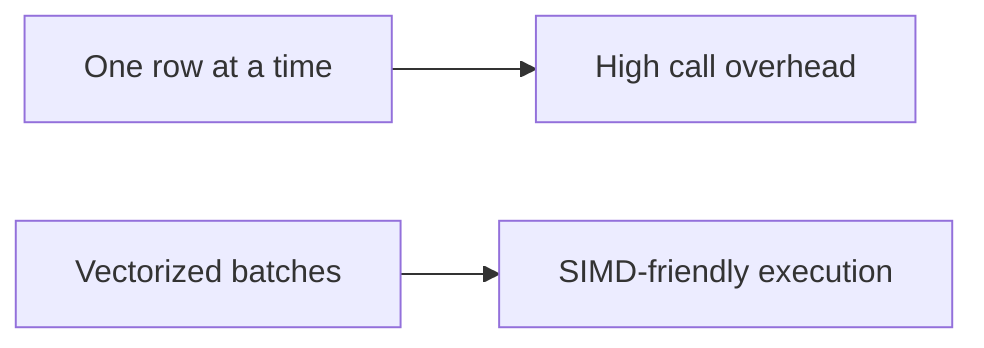

---

## 4.3. Distribution key and data placement

It is crucial to decide in advance how data will be distributed across nodes.

### Good distribution key

If tables are often joined by `user_id`, distributing by `user_id` helps co-location:

- data for one key stays close together;
- JOINs become cheaper;
- less shuffle is needed.

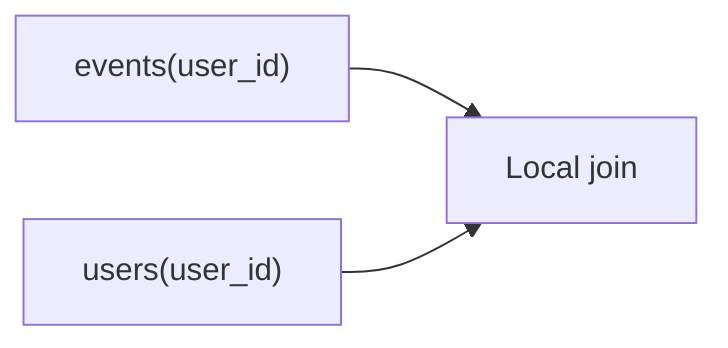

### Bad distribution key

- too low cardinality;
- severe skew;
- mismatch with the typical JOIN / GROUP BY key.

### Simple rule

`Good distribution key ≈ high cardinality + frequent join/group by key`

---

## 5. ClickHouse as an analytical MPP engine

ClickHouse is optimized for scan-heavy analytics.

### Core principles

- columnar storage;
- compression;
- vectorized execution;
- sparse index;
- background merges;
- `ORDER BY` as a physical sorting and data skipping mechanism.

### How storage is organized

- data is written into parts;
- parts are sorted;
- then merged in the background;
- queries read only the needed granules.

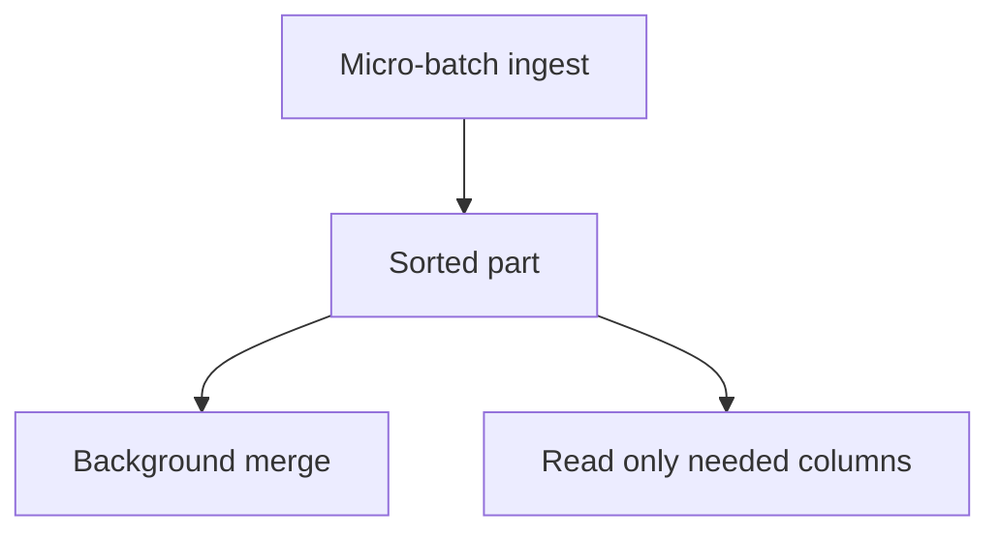

### Important detail

In ClickHouse, `ORDER BY` is not a B-tree in the classical OLTP sense.

It defines:

- physical ordering;
- sparse-index efficiency;
- the ability to skip large ranges of data.

### Query path

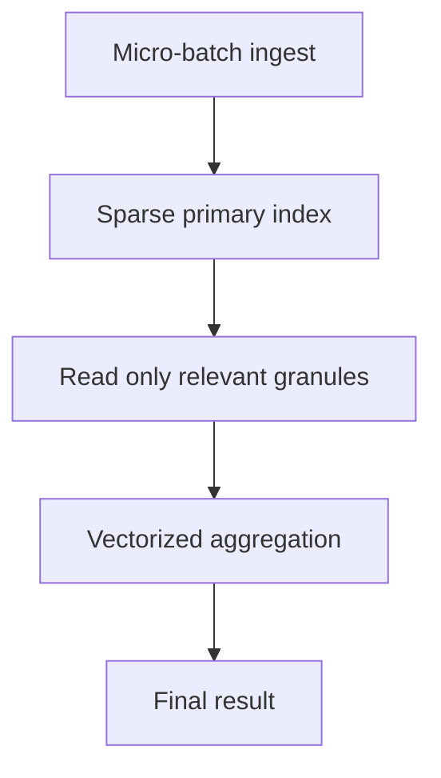

### Strengths of ClickHouse

- very fast aggregations;
- strong compression;
- excellent performance on wide-table scans;
- a great fit for denormalized models.

### Limitations of ClickHouse

- point lookups are not its main strength;
- many JOINs make life harder;
- frequent small inserts are inefficient;
- it is not a transactional OLTP system.

### When to choose ClickHouse

- BI / exploration;
- event analytics;
- dashboards for analysts;
- log analytics;
- large raw or near-raw datasets.

---

## 6. YDB as distributed SQL with analytical capabilities

YDB is a distributed SQL DBMS that combines:

- horizontal scaling;
- automatic sharding;
- strong consistency;
- ACID transactions;
- YQL as a SQL dialect;
- columnar tables and MPP for analytics.

### Architectural meaning

YDB sits between classical OLTP and pure OLAP.

It is useful when you need:

- one SQL layer;
- high fault tolerance;
- OLTP + analytics in the same platform;
- parallel reading of large tables;
- control over transactions and consistency.

### What YDB says about analytics

YDB supports columnar tables and MPP so that heavy queries can scale together with the cluster.

### Architectural view

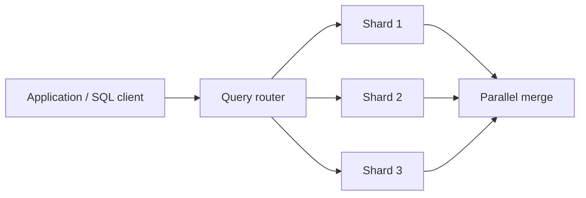

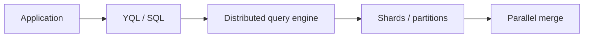

### Strengths of YDB

- strong consistency;
- ACID;
- automatic sharding;
- fault tolerance;
- one engine for different workload types;
- analytical queries on large tables with columnar storage modes.

### Limitations of YDB

- as a general-purpose system, it does not always beat specialized ClickHouse on pure OLAP;
- heavy analytical workloads still need careful design;
- the cost of universality shows up in architecture and trade-offs.

### When to choose YDB

- you need one distributed SQL backend;
- consistency and transactions matter;
- you have a mixed workload;
- you want horizontal scaling without losing the SQL model;
- analytics is important, but not necessarily the only or main workload.

---

## 7. SingleStore as an HTAP platform

SingleStore is a distributed SQL system with an HTAP approach.

### Core idea

SingleStore tries to serve:

- transactions;
- analytics;
- streaming ingestion;
- low-latency serving;

in one platform.

### Why this is possible

SingleStore has:

- rowstore for transactional / hot-path workload;
- columnstore for analytics;
- a distributed SQL layer;
- a unified storage engine;
- hidden rowstore buffering for small inserts into columnstore.

### How the two storage paths interact

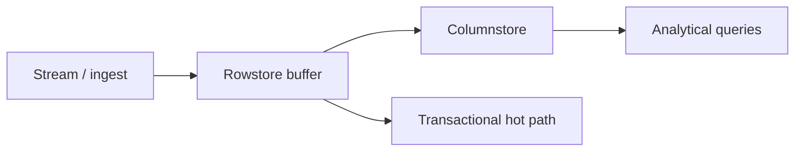

### Illustration

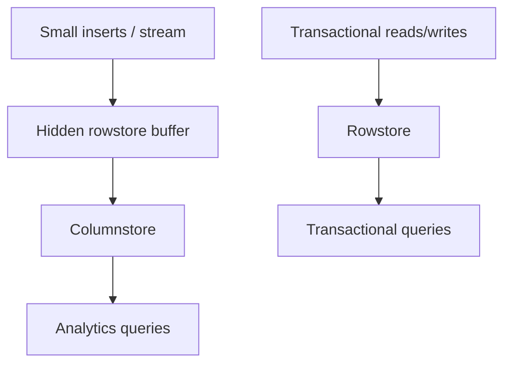

### What this means in practice

- fresh data can be accepted quickly;
- transactional queries can work on rowstore;
- analytics can read columnstore;
- the architecture is universal, but the compromises are expensive.

### Strengths of SingleStore

- HTAP;
- low-latency analytics;
- convenient integration of streaming data;
- fewer separate systems if you want a simpler architecture;
- support for both transactional and analytical workload.

### Limitations of SingleStore

- universality is usually more expensive than specialized OLAP;
- for pure analytics, ClickHouse is often faster and cheaper;
- for pure OLTP, a specialized OLTP system may be simpler and cheaper;
- HTAP is always a compromise between multiple workloads.

### When to choose SingleStore

- you need to combine OLTP and OLAP;
- near real-time analytics is important;
- you want one platform;
- you accept a performance trade-off in exchange for universality.

---

## 8. How to compare these systems

| Criterion | ClickHouse | YDB | SingleStore |
| --- | --- | --- | --- |
| Main focus | OLAP | Distributed SQL + MPP | HTAP |
| Storage model | columnar | row + columnar tables | rowstore + columnstore |
| Core strength | scan-heavy analytics | consistency + mixed workloads | unified transactional + analytical platform |
| Transaction + analytics mix | weaker | better than pure OLAP | very strong |
| Pure analytics | very strong | strong, but not always the best | strong, but with trade-offs |
| Complex JOINs and SQL | possible, but not the main goal | strong point | strong point |
| Cost of universality | low | medium | high |

### How to read this table

- if you need maximum analytical performance, ClickHouse often wins;
- if you need distributed SQL with strong consistency and analytical capabilities, look at YDB;
- if you need one universal layer for transactions and analytics, SingleStore is a reasonable choice.

### A simple decision rule

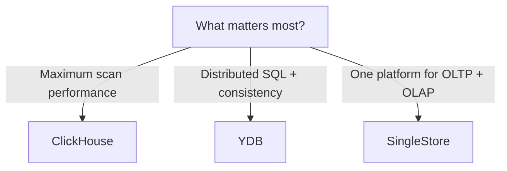

---

## 9. Typical data processing patterns

### Pattern 1. Batch analytics

- data arrives in batches;
- after loading, heavy analytical queries are run;
- I/O, compression, and scan speed are the main concerns.

### Pattern 2. Near real-time analytics

- data arrives continuously;
- fresh values must become visible quickly;
- ingestion speed, freshness, and low-latency serving are key.

### Pattern 3. Mixed workload

- some queries are transactional;
- some are analytical;
- concurrency and consistency matter;
- HTAP and distributed SQL become especially useful.

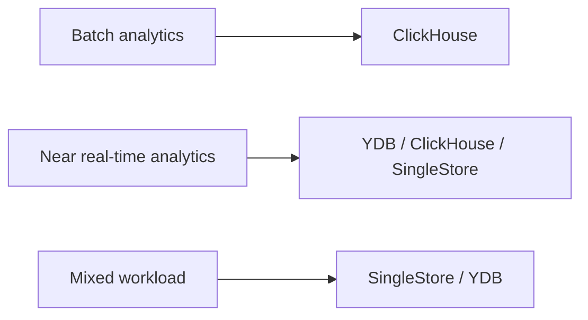

---

## 10. Ingestion is not a secondary topic

### Key idea

OLAP and MPP systems do not like row-by-row loading in the OLTP style.

### Why

- many tiny data parts;
- higher merge / compaction overhead;
- worse compression;
- more time spent on maintenance.

### The right approach

- batch;
- micro-batch;
- large ingestion chunks;
- streaming ingestion through prepared pipelines.

### For ClickHouse

- large inserts are better;
- parts are merged later;
- ingestion must be designed together with schema design.

### For YDB

- ingestion should account for sharding and the consistency model;
- parallel writes are useful;
- the analytical layer benefits when data is distributed without skew.

### For SingleStore

- small inserts are buffered first;
- later the data moves into columnstore;
- this helps combine fresh writes and analytics.

---

## 11. Anti-patterns

### What not to do

1. Use a row store as the main engine for large analytical scans.
2. Ignore the distribution key in a distributed system.
3. Assume that MPP automatically solves every performance problem.
4. Run high-cardinality GROUP BY without filters or without estimating memory usage.
5. Pick HTAP just because you want “one database for everything.”

### Practical principle

First define the workload, then choose the system.

---

## 12. How to explain the choice on an exam or defense

### If you choose ClickHouse

Say:

- the workload is scan-heavy;
- analytical speed is the priority;
- the data can be denormalized;
- compression and vectorization matter;
- a separate OLTP system is often acceptable.

### If you choose YDB

Say:

- you need distributed SQL;
- ACID and strong consistency matter;
- the workload is mixed;
- you want horizontal scaling;
- analytics must coexist with transactional data.

### If you choose SingleStore

Say:

- you need HTAP;
- both transactional and analytical workloads matter;
- you want fewer separate systems;
- you accept the cost of universality;
- low-latency analytics is important almost in real time.

---

## 13. Summary

- **ClickHouse** is a specialized MPP OLAP engine for scan-heavy analytics.
- **YDB** is a distributed SQL platform with MPP and columnar tables, useful for mixed workloads and strong consistency.
- **SingleStore** is an HTAP platform that combines rowstore and columnstore for universality.

### Main formula

**ClickHouse = maximum analytical efficiency.**  
**YDB = distributed SQL + consistency + analytics.**  
**SingleStore = transactions + analytics in one platform.**

---

## Short recap

- MPP speeds up processing through parallelism, but the price is data movement.
- Columnar storage reduces I/O and improves compression.
- Vectorized execution lowers CPU overhead.
- Distribution key determines whether JOINs are cheap or expensive.
- ClickHouse is best suited for pure analytics.
- YDB is interesting as a distributed SQL platform with analytical capabilities.
- SingleStore is strong in HTAP and near real-time scenarios, but it pays for universality.
