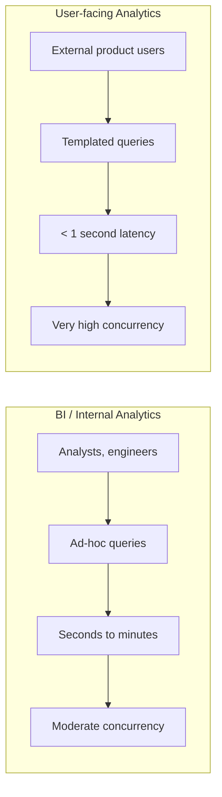
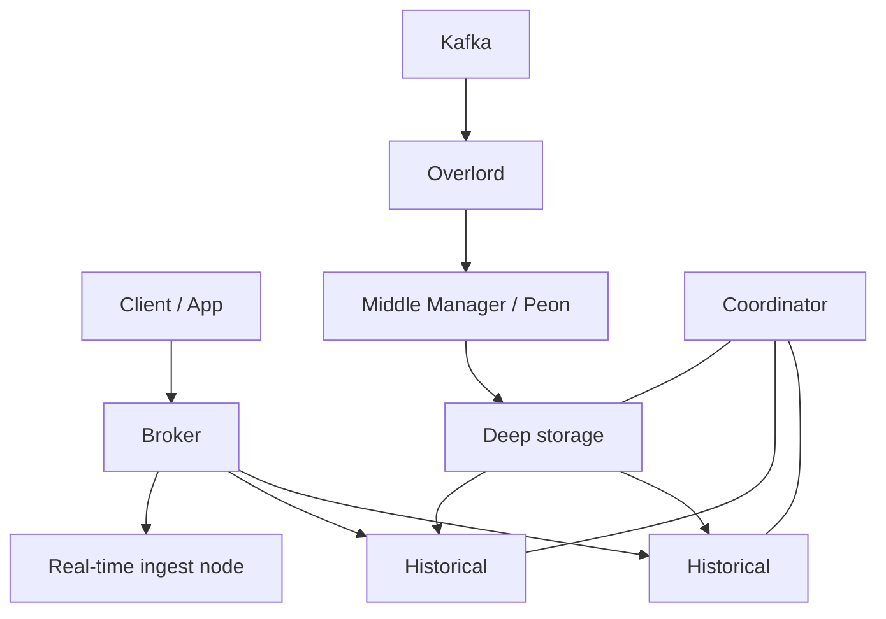
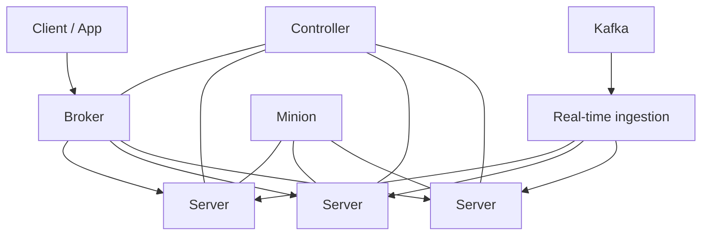
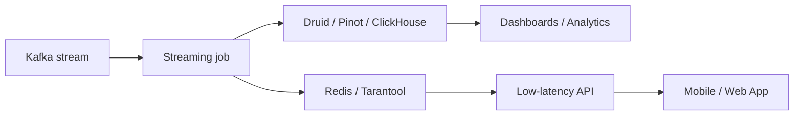
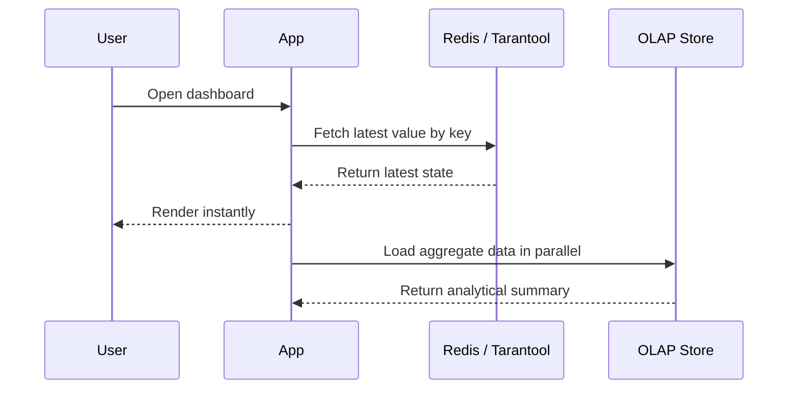

# Lecture 14. Real-time Analytics: Druid, Pinot, and In-memory

## Lecture Goal

Understand why user-facing analytics requires a separate architectural approach, how Apache Druid and Apache Pinot differ from classical OLAP systems, and what role in-memory storage plays in real-time architectures.

## 1. What is user-facing analytics

Classical BI analytics and user-facing analytics solve different problems.

### At a glance

### BI / internal analytics

- Users: analysts, data scientists, engineers.
- Queries: often ad-hoc, investigative, and complex.
- Latency: usually seconds or minutes.
- Concurrency: tens or hundreds of concurrent queries.

### User-facing analytics

- Users: external product users.
- Queries: mostly templated, parameterized, and repetitive.
- Latency: interactive speed is required, usually under 1 second and often tens of milliseconds.
- Concurrency: very high, up to thousands or even tens of thousands of concurrent queries.

Examples:

- an advertising dashboard with campaign metrics;
- analytics for a restaurant owner in a delivery app;
- interactive dashboards inside a product.

The key idea: here we care not only about the speed of a single query, but also about predictable latency under very high load.

## 2. Why classical OLAP is not always enough

Systems such as ClickHouse, Greenplum, and other DWH / OLAP solutions are excellent for:

- ad-hoc queries;
- raw data analysis;
- flexible JOINs and complex logic;
- work done by analysts and engineers.

But user-facing analytics often has different requirements:

- very high concurrency;
- strict latency SLAs;
- frequent repeated queries with a small set of filters and aggregations;
- the need to serve new data almost in real time.

This is what led to specialized real-time analytical databases.

## 3. Druid and Pinot: the same class, different implementations

Apache Druid and Apache Pinot belong to the same system class:

- distributed OLAP stores;
- designed for low-latency, high-throughput analytics;
- suitable for user-facing use cases;
- based on a scatter-gather architecture;
- optimize storage, indexing, and query routing for repeated OLAP patterns.

They should not be treated as “just another SQL engine.” These systems are designed primarily for predictable interactive analytics.

## 4. Apache Druid architecture

Druid has a clear separation between the query plane, control plane, and ingestion plane.

### Druid overview

### Main components

- **Broker** - accepts client queries, builds the execution plan, and performs scatter-gather across the relevant nodes.
- **Historical** - stores and serves historical immutable data segments from disk and memory.
- **Coordinator** - manages segment placement across Historical nodes, handles balancing, and applies placement rules.
- **Overlord** - manages ingestion tasks.
- **Middle Manager / Peon** - executes ingestion tasks.
- **Deep storage** - external storage for segments, such as S3, HDFS, or compatible systems.
- **Metadata store** - keeps segment metadata and cluster rules.

### Data flow in Druid

1. Data arrives from Kafka, files, or another source.
2. Ingestion tasks form segments.
3. Segments are written to deep storage.
4. Historical nodes load segments for query serving.
5. The Broker receives a query, sends it to the relevant nodes, and merges the result.

### Why it is fast

- data is organized into segments;
- segments are column-oriented and optimized for analytical filters;
- bitmap indexing is used for selected dimensions;
- historical segments can be stored compactly and read efficiently;
- queries go only to the nodes that actually store the needed data.

### Important note about Druid

Ingestion and query paths are separated in Druid. That is one of the reasons for good workload isolation, but it also makes the architecture more complex.

## 5. Apache Pinot architecture

Pinot solves a similar problem, but with its own component model.

### Pinot overview

### Main components

- **Controller** - manages the cluster and table metadata.
- **Broker** - accepts SQL queries, plans execution, and routes them to server nodes.
- **Server** - stores segments and executes queries.
- **Minion** - runs background maintenance and processing tasks, such as segment reprocessing.

### Data flow in Pinot

1. Data arrives from a stream or batch source.
2. For real-time tables, the server first keeps data in a consuming segment.
3. The consuming segment lives in memory and is queryable.
4. Then the segment is flushed into a completed segment and becomes a normal storage segment.
5. The Broker routes queries to the relevant server nodes and merges the results.

### What is important to remember

- Pinot was built specifically for user-facing real-time analytics.
- Low latency and high concurrency are typical for Pinot.
- It works well for templated analytical queries, not for arbitrary heavy SQL workloads with broad flexibility.

## 6. Performance secrets

### 6.1. Pre-aggregation / rollup

One of the key ideas in Druid and, in some scenarios, Pinot is pre-aggregating data during ingestion.

The idea:

- do not store every raw event if an aggregate is enough;
- merge records with the same dimensions and time granularity;
- drastically reduce storage volume;
- speed up queries by reducing the number of rows.

This is especially useful for scenarios such as:

- ad clicks;
- page views;
- per-minute or per-hour counters.

### The cost of rollup

- some detail is lost;
- raw events may not be available in their original form;
- you need to know in advance what granularity is actually needed.

### 6.2. Indexing for filters

These systems do not rely on one universal index. Instead, they use a set of specialized mechanisms.

#### Druid

- dictionary encoding;
- bitmap indexes for dimension columns;
- efficient AND / OR operations over compressed structures;
- good compression and segment-oriented data organization.

#### Pinot

- inverted index;
- sorted index;
- star-tree index for combinations of filters and aggregations;
- columnar storage and optimization for predictable queries.

Important: indexes and pre-aggregation are not enabled “everywhere by default.” They are chosen according to the specific schema and query profile.

### 6.3. Scatter-gather and role isolation

Both Druid and Pinot execute a query as follows:

1. the broker/router identifies the required segments;
2. the query is sent to multiple nodes;
3. partial results are collected and merged;
4. the client receives one final response.

This makes it possible to:

- scale storage and query serving independently;
- keep latency low;
- serve a large number of concurrent users.

## 7. ClickHouse vs. Druid / Pinot

This is not a “good vs. bad” comparison. These are different trade-offs.

| Characteristic | ClickHouse | Druid / Pinot |
| --- | --- | --- |
| Main goal | Flexible fast analytics on large datasets | User-facing analytics with very low latency |
| Query style | Ad-hoc, complex, broad | Templated, repetitive, filter + aggregation |
| Data | Often closer to raw events | Often pre-aggregated or heavily optimized |
| Indexing | Sparse primary index, data skipping indexes, projections, materialized views | Segment-oriented storage, bitmap / inverted indexes, rollup, star-tree |
| Concurrency | Good, but not always ideal for extreme QPS | Designed for very high concurrency |
| JOINs and complex SQL | A strong point | Usually more limited |
| Typical use case | BI, internal analytics, exploration | Dashboards for end users, real-time metrics |

The main conclusion: choose the system for the workload, not the fastest database in the abstract.

## 8. The role of in-memory systems

Redis, Tarantool, Hazelcast, and similar systems usually play a supporting role in real-time architectures.

### Where they fit

### Their strengths

- extremely fast key-based access;
- very low latency;
- good as a hot layer;
- suitable for cache, session storage, counters, feature lookup, and a serving layer.

### Typical use cases

1. **Serving real-time aggregates**

   A streaming job computes something like `route_id -> vehicle_count`, and the application reads the ready result from Redis or Tarantool.

2. **Stream enrichment**

   An event arrives with `user_id`, the system quickly fetches the user profile or features from the in-memory layer, and enriches the event before further processing.

3. **Caching**

   Heavy query results can be cached if they repeat frequently.

### The boundary

An in-memory layer usually does not replace an analytical database.

### In-memory as a hot path

It works well as:

- a cache;
- a hot storage layer for very fresh data;
- a point-lookup layer;
- a fast serving layer on top of the main analytical system.

## 9. When to choose what

### Choose ClickHouse if:

- you need ad-hoc queries;
- flexibility and broad SQL support matter;
- JOINs, exploration, and investigative analytics are important;
- keeping raw data is critical.

### Choose Druid or Pinot if:

- you need a user-facing dashboard;
- latency must be stable and very low;
- many queries are repeated;
- data arrives continuously;
- high concurrency and predictable performance are key.

### Add an in-memory layer if:

- you have very hot keys;
- you need ultra-fast access by exact key;
- you need a cache or enrichment layer on the processing path.

## 10. Summary

- User-facing analytics requires more than just “fast SQL”; it requires an architecture designed for low latency and high concurrency.
- Druid and Pinot solve this problem using segments, specialized indexes, scatter-gather, and partial pre-aggregation.
- ClickHouse remains a strong choice for flexible analytics and ad-hoc scenarios.
- In-memory systems complement the analytics stack, but usually do not replace it.

## Short formula

**BI analytics**: flexibility first.  
**User-facing analytics**: predictable speed first.  
**In-memory**: a hot layer for ultra-fast point access.
