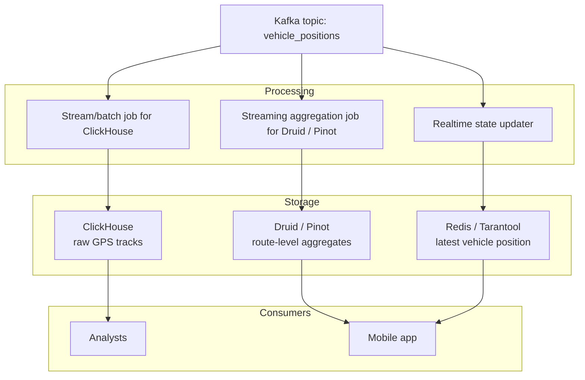

# Seminar 14. Real-time Analytics Architectures

## Seminar Goal

Learn to choose an architecture for a workload instead of “the fastest database overall.” In practice, students compare ClickHouse and Druid / Pinot, and one of the tasks also involves an in-memory layer.

## Tools

- draw.io
- Miro
- Excalidraw

## What is assessed

- correctness of the database choice;
- ability to connect requirements to architecture;
- quality of trade-off reasoning;
- appropriateness of the data model and ingestion;
- understanding of the trade-off between raw data, rollup, latency, and concurrency.

---

## Task 1. Marketing dashboard

### Scenario

The marketing team wants an internal BI dashboard to analyze advertising campaigns.

### Data

Kafka stream `ad_clicks` with:

- `timestamp`
- `campaign_id`
- `user_id`
- `country`
- `cost_per_click`

Volume: about 10 million events per day.

### Requirements

1. Access to raw data is required.
2. Ad-hoc SQL queries and JOINs with reference tables are required.
3. A response time of 5–10 seconds is acceptable.
4. 10–20 analysts will work at the same time.

### Reference solution

**Main database: ClickHouse**

Why:

- drill-down to every row is required;
- flexible ad-hoc queries are needed;
- concurrency is moderate;
- 5–10 seconds is a comfortable latency target for ClickHouse;
- rollup is not needed because it would break access to raw events.

### Possible architecture

`Kafka -> ingestion connector / streaming job -> ClickHouse -> BI tool`

Example ingestion layers:

- Kafka Connect;
- Vector;
- Flink;
- Debezium, if the stream is formed from CDC.

### Example table

```sql
CREATE TABLE ad_clicks
(
    event_time DateTime,
    campaign_id String,
    user_id UInt64,
    country LowCardinality(String),
    cost_per_click Float32
)
ENGINE = MergeTree
PARTITION BY toYYYYMM(event_time)
ORDER BY (campaign_id, event_time);
```

### Why this schema

- `MergeTree` is the standard analytical engine;
- `PARTITION BY toYYYYMM(event_time)` is useful for retention and deletion;
- `ORDER BY (campaign_id, event_time)` helps queries filtered by campaign and time.

### Teaching note

If the main filter in a real project is time rather than campaign, the order in `ORDER BY` can be changed. The key point is not a magic formula, but the link between the sort key and the typical query pattern.

### What not to do

- do not enable rollup in the main table;
- do not overcomplicate the schema unnecessarily;
- do not choose Druid / Pinot only because the problem says “real-time,” since raw data and flexible SQL matter more here.

---

## Task 2. User-facing dashboard for customers

### Scenario

You are building the “Profile Analytics” feature for a social network. Each user sees statistics about views of their posts.

### Data

Kafka stream `post_views` with:

- `timestamp`
- `post_id`
- `author_id`
- `viewer_id`
- `viewer_country`

Volume: about 1 billion events per day.

### Requirements

1. The dashboard must load in less than 500 ms.
2. There may be thousands of concurrent users.
3. Queries are repetitive and templated.
4. Storing every single view separately is not necessary if that makes the system cheaper and faster.

### Reference solution

**Main database: Druid or Pinot**

Both options are acceptable. For the workshop, it is fine to choose either one, as long as the choice is justified through latency, concurrency, and query regularity.

Below is the reference answer in a **Pinot** style, but a **Druid** style answer is also valid if the logic is preserved.

### Why this is a good fit for Pinot / Druid

- the queries are repetitive and predictable;
- very high query throughput is needed;
- pre-aggregation is acceptable;
- indexes and sketch-based aggregations can be used;
- the workload is user-facing analytics, not investigative BI.

### Possible architecture

`Kafka -> streaming ingestion job -> Pinot / Druid cluster -> backend API -> frontend`

### Ingestion and aggregation

For this task, it is preferable not to keep every event in raw form in the main serving database.

#### Recommended granularity

- `MINUTE` or `5 MINUTES` for the time axis;
- if a balance between freshness and size is needed, start with `MINUTE`.

#### Dimensions

- `author_id`
- `viewer_country`
- possibly `post_id` if per-post detail is needed

#### Metrics

- `views` = `COUNT(*)`
- `unique_viewers` = sketch-based distinct count, for example HLL / Theta sketch

### Why not `HOUR`

For a “last 5 minutes” window, hourly granularity is too coarse. It may work for very rough reports, but not for an interactive profile dashboard.

### What students should explain on defense

- rollup is appropriate here;
- exact distinct counting is expensive;
- approximate distinct is preferable for `unique_viewers`;
- the serving database is optimized for the standard query, not for arbitrary SQL.

### Why ClickHouse alone may be insufficient

ClickHouse can also solve this task, but:

- it may require more resources to handle very high concurrency;
- materialized views must be designed carefully;
- the load on raw data is higher;
- latency predictability at very large concurrency may be worse than in Druid / Pinot for this query pattern.

### Acceptable alternative

If a group chooses ClickHouse, that is not a mistake, but they must clearly show:

- which materialized views or aggregation tables are used;
- how low latency is achieved;
- why the cluster cost is still acceptable.

---

## Task 3. Hybrid real-time architecture

### Scenario

The `MetroPulse` system must serve both internal analysts and external users.

### Data

Kafka stream `vehicle_positions` with:

- coordinates;
- speed;
- `passengers_estimated`.

### Requirements

1. **A1:** analysts must run complex ad-hoc queries on raw GPS tracks; latency up to 30 seconds is allowed.
2. **B1:** the app must show a “Line Load” dashboard with the average number of passengers per route over the last 5 minutes; latency under 1 second.
3. **B2:** the app must show the last known position of a given `vehicle_id`; latency under 200 ms.

### Reference decomposition

- **A1 -> ClickHouse**
- **B1 -> Druid / Pinot**
- **B2 -> In-memory DB: Redis / Tarantool**

### Why this works

#### A1: ClickHouse

- raw data access is required;
- complex SQL queries are needed;
- latency up to 30 seconds is acceptable;
- it is a better fit for analysts and investigations.

#### B1: Druid / Pinot

- the query is templated;
- low latency is required;
- concurrency is high;
- data can be pre-aggregated by route and time;
- the serving layer matches their architecture very well.

#### B2: Redis / Tarantool

- access by key is required;
- only the latest state matters;
- this is not an analytical query, but a key-value lookup;
- an in-memory layer provides the lowest possible latency.

### Hybrid architecture



### Data flow

#### In ClickHouse

- data is loaded almost as-is;
- micro-batches can be used for ingestion;
- rollup is not required.

#### In Druid / Pinot

- the stream is aggregated over a time window;
- minute-level rollup is recommended;
- `average passengers` can be computed as `SUM(passengers_estimated) / COUNT(*)`;
- dimensions and sketch-based aggregation can be used for routes and time windows.

#### In Redis / Tarantool

- each new event updates the entry for `vehicle_id`;
- only the latest position is stored;
- previous values are overwritten.

### What is important to say

- one database is not required to solve all three subtasks equally well;
- real-time architectures often need a set of specialized stores;
- proper decomposition is usually more important than choosing “one ideal database.”

---

## Short trade-off review

### ClickHouse

- strong for raw analytics, ad-hoc queries, and JOINs;
- good for analysts;
- not always the best choice for extremely high-concurrency user-facing dashboards.

### Druid / Pinot

- strong for interactive analytics with templated queries;
- good at scaling concurrency;
- win when data can be pre-aggregated;
- usually less convenient for arbitrary SQL.

### In-memory systems

- the best option for hot lookup and “latest value” state;
- not a replacement for the main analytical database;
- ideal as an acceleration and serving layer.
