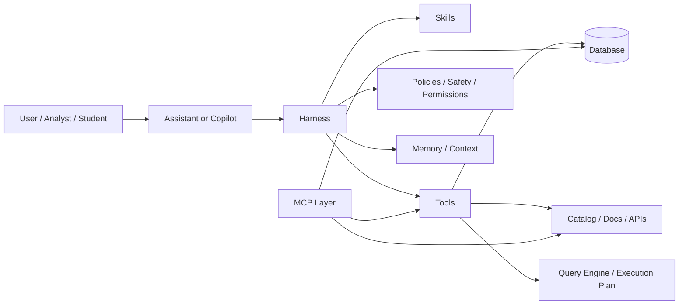
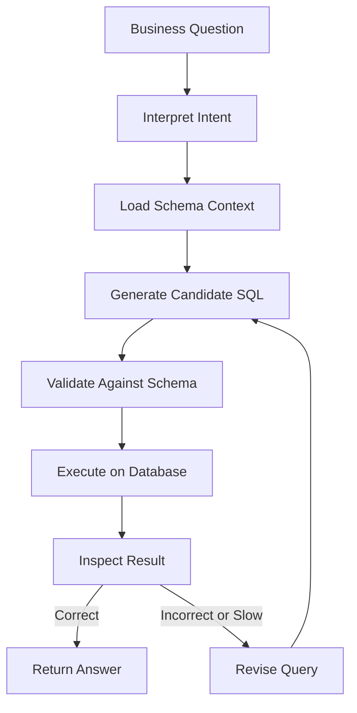
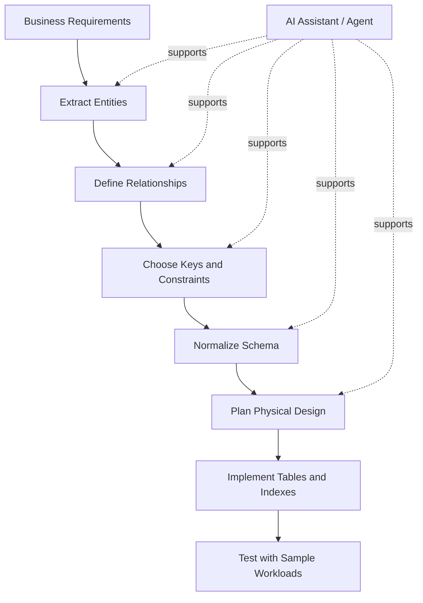

# AI Systems for Database Design and Querying: Copilots, Agents, Tools, and MCP

## 1. Why This Topic Matters

Modern database work is no longer limited to manual SQL writing. In practice, users interact with databases through a layered ecosystem of AI-enabled systems that help them:

- design schemas
- generate and debug queries
- explain database structures
- inspect data
- optimize performance
- automate repetitive analytics tasks
- connect business language to structured data systems

## 2. Core Vocabulary

### 2.1 AI Assistant
A general conversational system that helps users by answering questions, generating text, explaining concepts, or taking actions through tools.

In database contexts, an assistant may:

- answer SQL questions
- explain schemas
- help with query syntax
- summarize query results

### 2.2 Copilot
A copilot is an assistant embedded in a specific work environment.

In databases, a copilot is usually built into:

- SQL editors
- BI tools
- database IDEs
- notebook environments
- data catalogs

Its main goal is to help the user inside the workflow, not outside it.

### 2.3 Agent
An agent is a more autonomous system that can:

- set intermediate steps
- choose tools
- inspect results
- revise its plan
- continue until a goal is reached or blocked

For example:

- "Find the root cause of this slow query"
- "Create a draft schema from this business description"
- "Compare two versions of a query and suggest improvements"

### 2.4 Harness
A harness is the orchestration layer around the model.

It usually handles:

- prompt assembly
- tool routing
- memory and context packaging
- permissions
- retries
- logging
- evaluation
- safety checks
- state management

The harness is not the model itself. It is the system that makes the model useful and reliable.

### 2.5 Skill
A skill is a reusable task package or workflow.

Examples:

- generate SQL from natural language
- analyze an execution plan
- normalize a schema
- explain a join strategy
- extract entities from business requirements

Skills make the system more modular and easier to maintain.

### 2.6 Tool
A tool is an executable capability that the AI can call.

Examples:

- database query execution
- schema introspection
- search
- profiling
- explanation of execution plans
- catalog lookup
- documentation retrieval

The model reasons, but tools do the real external work.

### 2.7 MCP
MCP, or Model Context Protocol, is a standardized way to connect models to external tools, data sources, and context providers.

In simple terms, MCP helps AI systems talk to:

- databases
- file systems
- internal docs
- APIs
- catalogs
- analytics systems

It makes integrations more modular and reusable.

## 3. A Useful Mental Model

Think of the stack like this:

- User expresses intent
- Assistant or copilot interprets the request
- Agent plans and executes multi-step work
- Harness manages the loop and policies
- Skills provide reusable workflows
- Tools perform real actions
- MCP connects the system to external context and capabilities
- Database is the actual data system being queried or designed

## 4. Taxonomy of AI Support for Databases

| Term | Main Role | Example in Databases |
| --- | --- | --- |
| Assistant | Conversational help | Explain this SQL query |
| Copilot | Embedded workflow support | SQL autocomplete in a query editor |
| Agent | Goal-driven automation | Tune this query and verify results |
| Harness | Orchestration and control layer | Context, tools, permissions, logs |
| Skill | Reusable procedure | Generate normalized schema |
| Tool | External executable capability | Run SQL, fetch schema, inspect plans |
| MCP | Standard integration protocol | Connect AI to DB metadata and tools |

## 5. Why the Distinction Matters

These terms are often mixed together, but they are not the same.

If we confuse them:

- we may expect a copilot to behave like an agent
- we may expect a model to work without tools
- we may overtrust natural language output
- we may miss security and governance issues
- we may design weak systems that are hard to maintain

If we separate them clearly:

- we can design better workflows
- we can assign responsibilities more precisely
- we can build safer database AI systems
- we can teach students a realistic architecture

## 6. Lecture Theme: AI Across the Database Lifecycle

### 6.1 Requirements analysis
AI can help convert business descriptions into database concepts.

Example tasks:

- extract entities
- identify relationships
- detect business rules
- find missing assumptions

### 6.2 Conceptual design
AI can assist with:

- ER modeling
- cardinality inference
- naming suggestions
- conceptual normalization

### 6.3 Logical design
AI can help:

- propose table structures
- suggest primary and foreign keys
- draft constraints
- identify redundancy

### 6.4 Physical design
AI can assist with:

- index recommendations
- partitioning ideas
- storage strategy
- denormalization trade-offs

### 6.5 Querying and analytics
AI can help:

- generate SQL
- explain SQL
- debug SQL
- optimize SQL
- translate business language into queries

### 6.6 Maintenance and governance
AI can help:

- generate documentation
- classify sensitive fields
- describe lineage
- support auditing and monitoring

## 7. How Assistants, Copilots, and Agents Differ in Practice

### 7.1 Assistant behavior
An assistant answers directly.

Example:

- What does LEFT JOIN do?
- Explain this query in plain English.

### 7.2 Copilot behavior
A copilot works inside a task context.

Example:

- while the user is writing SQL, it suggests columns, joins, or completions
- while the user is designing a schema, it suggests keys and constraints

### 7.3 Agent behavior
An agent solves a task through multiple steps.

Example:

- inspect schema
- generate query
- run query
- inspect result
- revise query
- summarize findings

This is much closer to an autonomous workflow.

## 8. The Role of the Harness

The harness is the hidden engine that makes the system reliable.

A database AI harness may include:

- system prompts and policy rules
- context assembly from schema and docs
- tool execution and retries
- conversation state
- user permission checks
- logging and audit trail
- evaluation against test cases
- failure handling and fallback logic

Without a harness, a model is just a text generator. With a harness, it becomes part of a controlled system.

## 9. The Role of Skills

Skills are useful when tasks repeat.

Examples of database skills:

- design a 3NF schema from requirements
- convert business rules into SQL constraints
- explain why a query is slow
- write a window-function solution
- normalize a denormalized table
- generate test queries for schema validation

Skills help with:

- consistency
- reuse
- maintainability
- easier scaling across tasks or teams

## 10. The Role of Tools

Tools give the AI real capabilities beyond language generation.

Typical database tools:

- SQL execution
- schema introspection
- EXPLAIN or query plan inspection
- index suggestion tools
- data profiling
- catalog search
- metadata lookup
- sample data retrieval

A strong AI system is not "smart" only because it writes fluent text. It is useful because it can act on the database environment.

## 11. The Role of MCP

MCP is important because database AI systems often need many external connections.

MCP can provide access to:

- database schemas
- query engines
- data catalogs
- documentation systems
- internal APIs
- notebooks
- file systems
- dashboards

### Why it matters

- reduces custom integration work
- standardizes tool access
- supports modular architecture
- makes it easier to swap tools and sources
- improves maintainability

## 12. Architecture Diagram

## 13. Workflow Diagram for Database Querying

## 14. Workflow Diagram for Database Design

## 15. Agentic Database Workflow Example

An agent can be more powerful than a copilot when the task requires iteration.

### Example goal
Investigate why this dashboard is slow.

### Agent steps

1. inspect the dashboard query
2. identify the slow SQL fragment
3. check table sizes and indexes
4. inspect execution plan
5. suggest rewrite or index changes
6. test the improvement
7. summarize findings

This is a good example of why agent is a different concept from copilot.

## 16. Example of a Skills-Based System

A database AI platform can be designed as a set of skills.

Possible skills:

- schema_extraction
- sql_generation
- sql_explanation
- query_debugging
- index_recommendation
- schema_normalization
- documentation_generation
- metadata_retrieval

Each skill can be:

- called directly
- selected by the agent
- routed through the harness
- connected to tools through MCP

This makes the system scalable and easier to teach.

## 17. Strengths of the Full Stack Approach

When assistants, agents, skills, tools, harnesses, and MCP work together, the system gains:

- better accuracy through grounding
- better repeatability through skills
- better automation through agents
- better maintainability through the harness
- better extensibility through tools
- better interoperability through MCP

This is much stronger than treating AI as only a chat box.

## 18. Risks and Failure Modes

### 18.1 Hallucinated schema details
The AI may invent tables or columns.

### 18.2 Wrong assumptions
The AI may guess business rules incorrectly.

### 18.3 Tool misuse
An agent may choose an inefficient or unsafe action.

### 18.4 Prompt injection
Malicious text in metadata or data sources can manipulate the model.

### 18.5 Over-autonomy
An agent may appear confident while actually being wrong.

### 18.6 Poor harness design
If the harness is weak, the system may be hard to debug, unsafe, or inconsistent.

## 19. Safety and Governance

Database AI systems must respect:

- access control
- least privilege
- privacy requirements
- auditability
- logging policies
- data retention rules
- regulated-data boundaries

This is especially important when the system can:

- read production data
- generate executable SQL
- modify schema
- expose sensitive records

## 20. Lecture Takeaways

- an assistant answers questions
- a copilot supports a specific workflow
- an agent executes multi-step goals
- a harness orchestrates the system
- a skill packages repeatable behavior
- a tool performs real actions
- MCP standardizes how the AI connects to external context and capabilities

And, most importantly:

- AI does not replace database thinking
- AI changes how database work is done
- human verification remains essential

