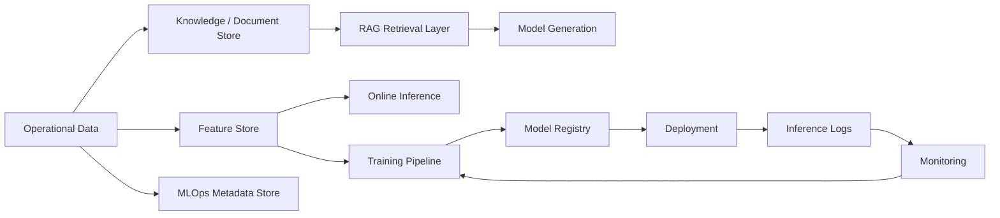
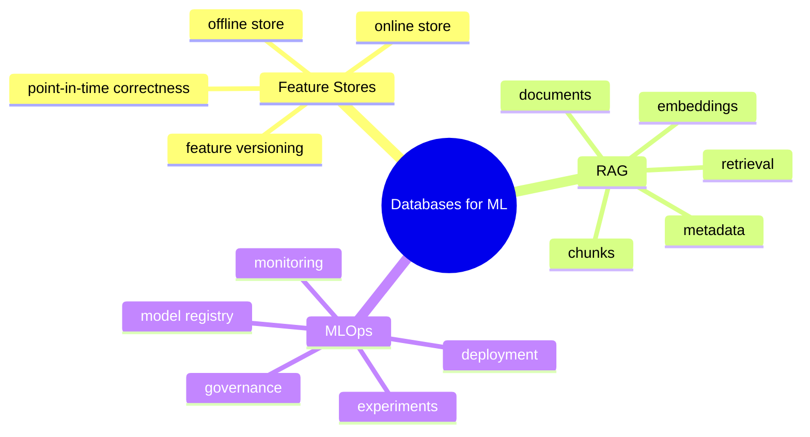
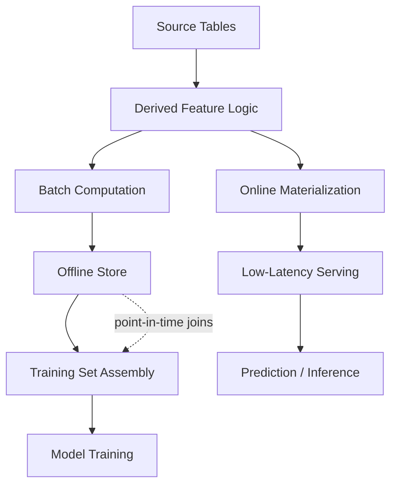
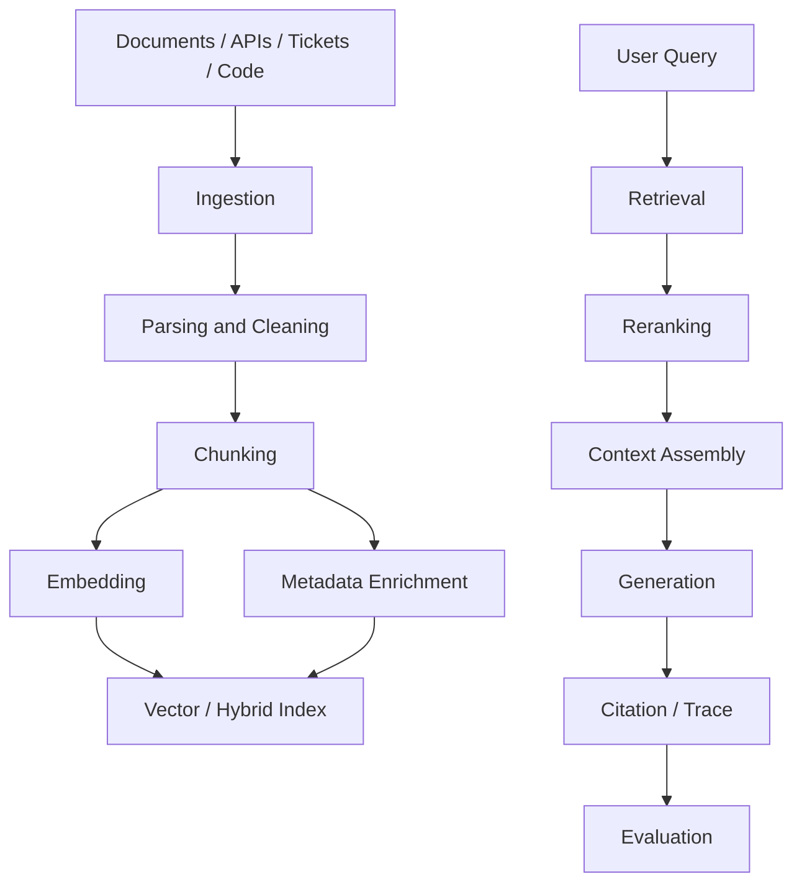
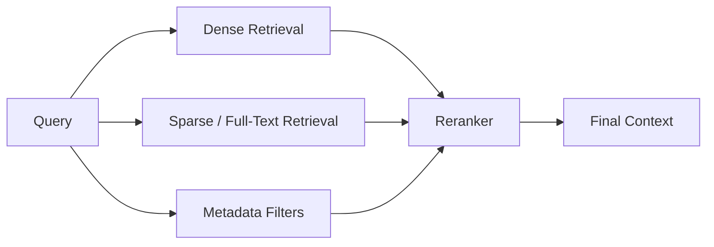
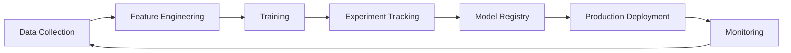
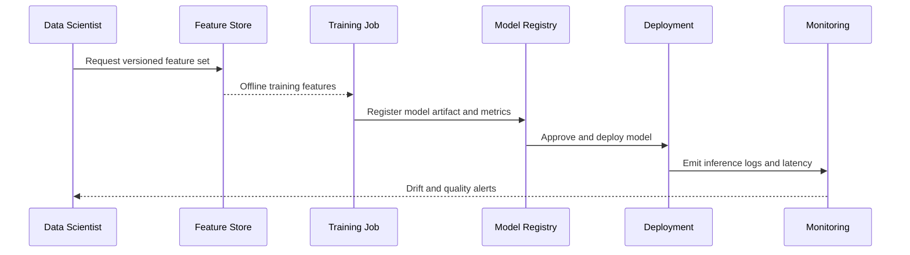
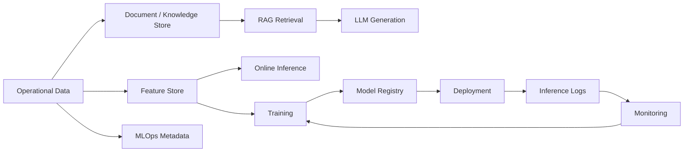
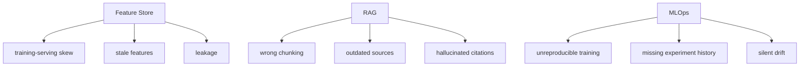
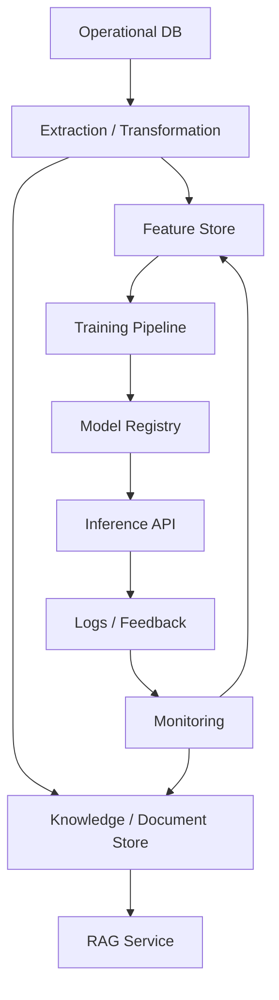

# Databases for ML: Feature Stores, RAG, and MLOps

## Lecture Notes

### Main Idea
Modern machine learning systems do not merely “consume data.” They require a carefully designed data layer that stores operational records, training examples, features, documents, embeddings, metadata, prompts, model outputs, evaluation traces, and governance artifacts. In other words, the database is no longer only the system of record for business transactions. It is also the control surface for machine learning, retrieval, and model operations.

The central thesis of this lecture is:

> An effective ML system is an information system with multiple data planes: operational data, feature data, knowledge data, and observability data.

Understanding how these planes are modeled, indexed, versioned, and governed is a core database skill in contemporary AI engineering.

### High-Level Architecture



---

## 1. Why Databases Matter in ML Systems

A model is not trained directly on “data” in the abstract. It is trained on a curated, versioned, and traceable representation of the world.

ML systems require:

- training datasets
- feature definitions
- point-in-time correct lookups
- online and offline serving paths
- document and knowledge retrieval
- prompt and response logging
- experiment tracking
- model registry metadata
- monitoring and drift detection
- evaluation datasets
- access control and auditability

These requirements turn the database layer into a strategic component of the ML stack.

---

## 2. The Three Pillars of the Lecture

This lecture focuses on three major database-related patterns in ML engineering:

1. **Feature Stores**
2. **RAG Systems**
3. **MLOps Data Infrastructure**

These are related but not identical.

- Feature stores are primarily about consistent feature computation and serving.
- RAG systems are primarily about retrieving external knowledge and grounding generation.
- MLOps is the broader discipline of managing the ML lifecycle, including data, models, experiments, deployment, monitoring, and governance.

Together, they show how databases evolve from passive storage systems into active infrastructure for AI.

### Conceptual Map



---

## 3. Feature Stores: The Database Layer for ML Features

### 3.1 What Is a Feature?

A **feature** is a measurable property of an entity used by a machine learning model.

Examples:

- number of purchases in the last 30 days
- average order value
- time since last login
- customer segment
- count of failed payments
- number of support tickets in the last week

Features are not the raw business data itself. They are derived, time-aware representations of that data.

### 3.2 Why Feature Stores Exist

Without a feature store, teams often compute the same features in multiple places:

- in notebooks for training
- in backend services for inference
- in ad hoc SQL for analysis
- in pipelines for batch scoring

This creates problems:

- feature definitions drift over time
- training and serving logic diverge
- engineering work is duplicated
- point-in-time correctness is difficult
- reproducibility becomes fragile

A feature store addresses these problems by providing a controlled, reusable layer for feature computation and serving.

### 3.3 Core Responsibilities of a Feature Store

A feature store typically supports:

- feature definitions
- batch feature computation
- online feature serving
- offline historical retrieval
- feature versioning
- point-in-time correct joins
- access control
- lineage and metadata
- monitoring and freshness checks

### 3.4 Offline vs Online Feature Store

The distinction between offline and online storage is central.

- **Offline store**: optimized for training, backfills, analytics, and historical reconstruction.
- **Online store**: optimized for low-latency inference-time lookup.

The same feature may exist in both stores, but their access patterns differ.

For example, a fraud model might need:

- offline: historical transaction counts for training
- online: current risk score or recent activity count at prediction time

### 3.5 Point-in-Time Correctness

This is one of the most important database ideas in feature engineering.

Suppose we train a model to predict whether a customer will churn. If we join customer records with future events accidentally, the model learns from information that would not have been available at prediction time. This is called **data leakage**.

Point-in-time correctness means:

> when reconstructing a training example, the system must only use information that was available at that exact time.

This is fundamentally a database problem involving temporal modeling, historical joins, and versioned facts.

### 3.6 Feature Store Schema Ideas

A practical feature store often contains tables or collections such as:

```sql
entities (
    entity_id,
    entity_type,
    created_at
)

feature_definitions (
    feature_id,
    feature_name,
    description,
    entity_type,
    value_type,
    owner,
    version,
    created_at
)

feature_values_offline (
    entity_id,
    feature_id,
    event_time,
    feature_value,
    computed_at,
    source_version
)

feature_values_online (
    entity_id,
    feature_id,
    feature_value,
    updated_at
)
```

Important metadata usually includes:

- feature name
- entity type
- version
- owner
- freshness policy
- computation logic
- source tables
- access level
- model compatibility

### 3.7 Typical Feature Store Use Cases

- churn prediction
- fraud detection
- recommendation systems
- dynamic pricing
- credit scoring
- lead scoring
- personalization

### 3.8 What a Feature Store Is Not

A feature store is not just:

- a table with precomputed columns
- a cache
- a data warehouse
- a vector database

It is a managed system for defining, computing, versioning, and serving features consistently across training and inference.

### Feature Store Flow



---

## 4. RAG: Retrieval-Augmented Generation as a Database Architecture

### 4.1 Why RAG Belongs in a Databases Lecture

RAG is not merely a language-model trick. It is a data architecture pattern in which the model retrieves relevant external information before generating an answer.

This means RAG depends heavily on:

- document modeling
- metadata design
- indexing
- search
- versioning
- chunking
- filtering
- traceability
- access control

So RAG is deeply connected to database design.

### RAG as a Data System



### 4.2 The RAG Pipeline

```text
Sources
  → ingestion
  → parsing
  → cleaning
  → chunking
  → enrichment
  → embedding
  → indexing
  → retrieval
  → reranking
  → context assembly
  → generation
  → citation / trace
  → evaluation
  → feedback loop
```

This is a full data pipeline, not a single algorithm.

### Retrieval Layers



### 4.3 What RAG Stores

Typical RAG systems manage:

- raw documents
- chunks
- embeddings
- metadata
- document versions
- source references
- retrieval logs
- generated answers
- citations
- feedback labels
- evaluation datasets

### 4.4 Why “Put PDFs in a Vector DB” Is Not Enough

This is a common misconception.

A high-quality RAG system needs more than embeddings:

- text extraction and cleaning
- document structure preservation
- version control
- metadata filtering
- access rules
- hybrid retrieval
- reranking
- source attribution
- quality evaluation

If these pieces are missing, the system may retrieve something similar but semantically wrong, outdated, or unauthorized.

### 4.5 Chunking as Knowledge Modeling

Chunking is not a purely technical step. It is a modeling decision.

If chunks are too large:

- retrieval becomes noisy
- irrelevant text is included
- context windows fill up quickly

If chunks are too small:

- meaning is fragmented
- references are lost
- retrieval becomes brittle

Useful chunking strategies:

- by headings
- semantic chunking
- recursive chunking
- parent-child chunking
- table-aware chunking
- code-aware chunking
- sliding window chunking

### 4.6 Metadata-First Retrieval

Metadata is often the difference between a useful RAG system and a weak one.

Important metadata fields may include:

- document type
- source URI
- owner
- version
- validity interval
- language
- access level
- section path
- domain
- entity references
- checksum

In practice:

> embeddings answer “what is similar,” while metadata answers “what is allowed, current, and relevant.”

### 4.7 Hybrid Search

Pure vector search is rarely enough. Many domains require hybrid retrieval:

- dense retrieval for semantic similarity
- sparse retrieval for exact terms
- metadata filters for scope
- reranking for precision

This is especially important for:

- legal documents
- technical documentation
- code repositories
- product manuals
- regulations
- error codes

### 4.8 Minimal RAG Data Model

```sql
documents (
    document_id,
    source_uri,
    title,
    doc_type,
    version,
    checksum,
    created_at,
    valid_from,
    valid_to
)

chunks (
    chunk_id,
    document_id,
    section_path,
    chunk_text,
    token_count,
    embedding,
    metadata_json,
    created_at
)

retrieval_logs (
    retrieval_id,
    user_query,
    retrieved_chunk_ids,
    rerank_scores,
    final_context,
    generated_at
)
```

This is a useful conceptual baseline.

### 4.9 Evaluation of RAG

Important metrics include:

- recall@k
- precision@k
- mean reciprocal rank
- context relevance
- groundedness
- faithfulness
- citation accuracy
- no-answer quality
- latency
- cost per query

RAG evaluation is not optional. Without it, the system can appear fluent while being unreliable.

---

## 5. MLOps: Database Support for the ML Lifecycle

### 5.1 What Is MLOps?

MLOps is the discipline of managing the machine learning lifecycle with production-grade engineering practices.

It includes:

- data collection
- feature engineering
- training
- experiment tracking
- model registration
- deployment
- monitoring
- drift detection
- retraining
- governance

Databases support all of these stages.

### MLOps Lifecycle



### 5.2 Why MLOps Needs Data Infrastructure

ML systems fail when:

- the training data cannot be reproduced
- the model version is unclear
- the feature definitions are inconsistent
- the evaluation data is missing
- the monitoring signals are not stored
- the deployment history is not auditable

This is why MLOps is not only a model problem. It is a data management problem.

### 5.3 Core MLOps Tables and Artifacts

An MLOps platform may store:

- datasets
- dataset versions
- training jobs
- experiment runs
- hyperparameters
- metrics
- model artifacts
- model registry records
- deployment records
- inference logs
- drift statistics
- feedback labels
- incident reports

### 5.4 Example MLOps Metadata Schema

```sql
training_runs (
    run_id,
    model_name,
    dataset_version,
    feature_set_version,
    code_version,
    started_at,
    finished_at,
    status
)

model_registry (
    model_id,
    model_name,
    version,
    artifact_uri,
    training_run_id,
    approved_by,
    approval_status,
    created_at
)

inference_logs (
    inference_id,
    model_id,
    request_id,
    request_features,
    prediction,
    confidence,
    latency_ms,
    served_at
)
```

### 5.5 Experiment Tracking

Experiment tracking answers questions such as:

- Which dataset version was used?
- Which features were included?
- Which hyperparameters were chosen?
- What metrics were achieved?
- Which model version was promoted?

This is essential for reproducibility and comparison.

### 5.6 Monitoring and Drift

Production models can degrade over time because:

- the data distribution changes
- user behavior changes
- input quality changes
- the business process changes
- labels arrive late

Common monitoring signals:

- input feature drift
- prediction drift
- calibration drift
- latency
- error rate
- business KPI shift

These signals must be stored and analyzed in database-backed systems.

### MLOps Metadata Loop



---

## 6. How the Three Topics Fit Together

Feature stores, RAG, and MLOps are separate but interconnected.

- Feature stores focus on structured predictive features.
- RAG focuses on knowledge retrieval and grounded generation.
- MLOps focuses on lifecycle management and operational control.

All three require:

- careful schema design
- versioning
- lineage
- metadata
- access control
- observability
- reproducibility

That is why they belong in a databases course.



---

## 7. Database Design Principles for ML Systems

### 7.1 Treat time as first-class data

ML systems are highly temporal. You must know:

- when a feature was computed
- when a document became valid
- when a model was trained
- when a prediction was made
- when feedback was received

### 7.2 Preserve lineage

Every important artifact should be traceable:

- where did the feature come from?
- which document source was used?
- which model produced the prediction?
- which training dataset was used?

### 7.3 Separate online and offline needs

Online inference and offline analytics have different performance and consistency requirements. A good design reflects this difference explicitly.

### 7.4 Version everything that matters

Version:

- features
- datasets
- documents
- embeddings
- prompts
- models
- evaluation sets
- business rules

### 7.5 Design for governance

ML systems may involve sensitive data, regulated data, or proprietary knowledge. The architecture must support:

- authorization
- audit trails
- masking
- retention policies
- deletion workflows
- compliance reporting

---

## 8. Common Failure Modes

### Feature stores

- training-serving skew
- stale features
- leakage through future data
- inconsistent definitions
- missing backfill logic

### RAG

- wrong chunking
- missing metadata filters
- outdated sources
- hallucinated citations
- prompt injection through retrieved text
- retrieval of semantically similar but incorrect content

### MLOps

- irreproducible training
- unclear model versioning
- missing experiment history
- silent drift
- deployment without approval
- weak observability

These are not abstract concerns. They are the most common causes of failure in production ML systems.

### Common Failure Modes by Layer



---

## 9. Practical Example: Customer Churn Platform

Suppose we are building a churn prediction system for a subscription business.

### Operational data

- customers
- subscriptions
- payments
- support tickets
- product usage events

### Feature store examples

- number of logins in the last 7 days
- number of failed payments in the last 90 days
- number of support tickets in the last month
- average session duration

### RAG knowledge layer

- product documentation
- support policies
- internal playbooks
- pricing rules
- contract terms

### MLOps layer

- training run metadata
- feature set version
- model registry
- deployment history
- monitoring dashboard

The point is that all of these data types must be modeled, versioned, and governed together.

### End-to-End Example Architecture



---

## 10. Key Takeaways

- ML systems require more than raw data storage.
- Feature stores are databases for consistent feature computation and serving.
- RAG is a retrieval architecture that depends on documents, embeddings, metadata, and evaluation.
- MLOps is the operational discipline that manages the lifecycle of models and their data.
- Database design remains central because all three patterns depend on schema, indexing, versioning, lineage, and governance.

The most important lesson is that databases are not being replaced by ML. They are becoming more important because ML systems need stronger data engineering, stronger traceability, and stronger control.
